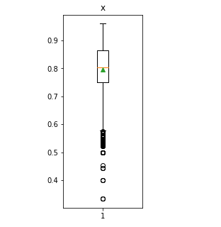
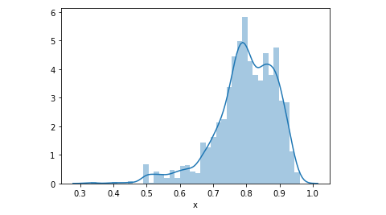
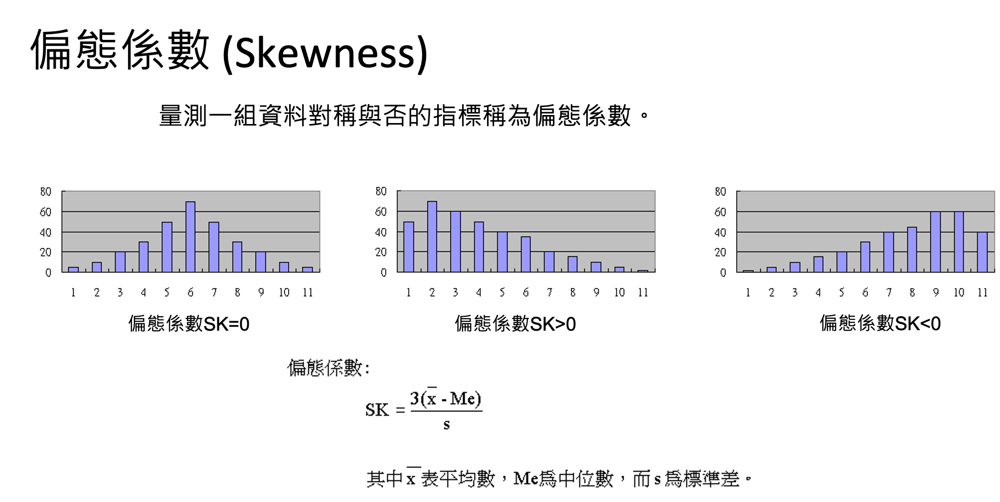
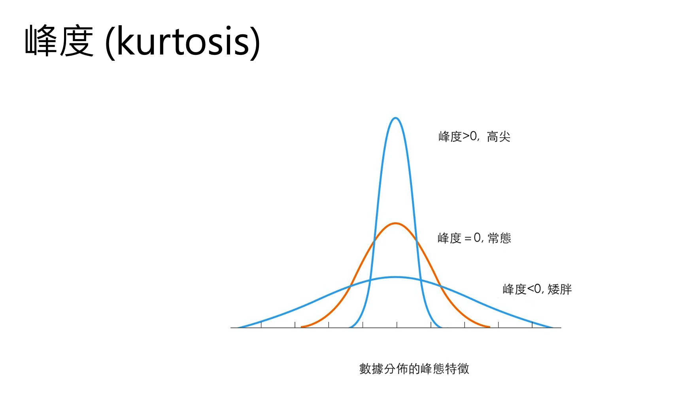
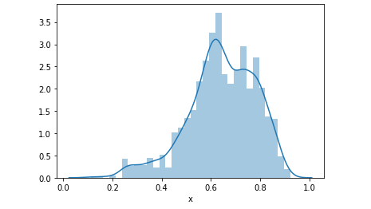
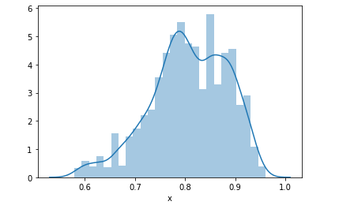

## 前言
Data Preprocessing(資料前處理)，是機器學習中最重要的一部分。本篇文章中可分為兩部份，前半部份算是一些對資料的觀察、分析(EDA)，後半部主要是針對特徵x進行離群值處理。

## 資料觀察
這筆數據是隨機產生的資料集，共有2998筆數據，特徵 x 僅有一個。

- 資料筆數： 2998
- 特徵數： 1

```python
# 查看資料分布狀況
data.describe()
```

```
count	2998.000000
mean	0.797100
std	    0.091927
min	    0.333300
25%	    0.750000
50%	    0.803750
75%	    0.864825
max	    0.960000
```

### 箱型圖
透過 boxplot 來查看特徵 x 在 3143 筆資料中的分布狀況，我們可以看出平均值約 0.8，最大值接近 1，最小值接近 0。其中值大多介於0.6~1之間，其大的數目屬於零星的數量。

```python
plt.figure(figsize=(2,5))
plt.boxplot(data['x'],showmeans=True)
plt.title('x')
plt.show()
```



### 分布狀態
從分布狀態與和密度估計圖可以發現，特徵 x 有左偏的情形。左偏(負偏)，表示有少數幾筆資料很小，故平均數<中位數，所以偏態係數SK<0。

```python
import seaborn as sns
sns.distplot(data['x'])
plt.show()
```



### 偏態&峰度

```python
#skewness and kurtosis
print("偏態(Skewness): {:.2f}".format(data['x'].skew()))
print("峰度(Kurtosis): {:.2f}".format(data['x'].kurt()))
```

```
偏態(Skewness): -1.09
峰度(Kurtosis): 1.80
```

- 中間圖右偏(正偏)，表示有少數幾筆資料很大，故平均 數>中位數，所以偏態係數SK>0。 
- 右邊圖左偏(負偏)，表示有少數幾筆資料很小，故平均 數<中位數，所以偏態係數SK<0。　 




## 離群值處理
這裡提供兩種常見的方法來對資料進行處理，第一個是將左偏的資料取平方。第二種是透過分位數來移除離群值。

### 方法1: 特徵取平方
因為資料型態左偏，因此我們可以透過取平方來將資料拉回使為更集中。

```python
exp_data = np.power(data['x'], 2)
exp_data = exp_data.replace([np.inf, -np.inf, -0], 0)
sns.distplot(exp_data)
plt.show()
```


偏態(Skewness): -0.64

> 處理右偏的資料可以參考[這篇](https://medium.com/%E4%BA%82%E9%BB%9E%E6%8A%80%E8%83%BD%E6%A8%B9%E7%9A%84%E4%BA%BA%E7%94%9F/5%E7%A8%AE%E4%BF%AE%E6%AD%A3%E8%B3%87%E6%96%99%E5%81%8F%E6%85%8B%E7%9A%84%E6%96%B9%E6%B3%95%E5%8F%8A%E5%85%B6python%E6%87%89%E7%94%A8-c387c4f32ebe)文章

### 方法二: 移除離群值
在Q3＋1.5IQR（四分位距）和Q1-1.5IQR處畫兩條與中位線一樣的線段，這兩條線段為異常值截斷點，稱其為內限；在Q3＋3IQR和Q1－3IQR處畫兩條線段，稱其為外限。處於內限以外位置的點表示的數據都是異常值，其中在內限與外限之間的異常值為溫和的異常值（mild outliers），在外限以外的為極端的異常值 (extreme outliers)。


[參考來源](https://wiki.mbalib.com/zh-tw/%E7%AE%B1%E7%BA%BF%E5%9B%BE)

因此我們必須將超出1.5倍的極端異常值清掉。

```python
print ("Shape Of The Before Ouliers: ",data.shape)
n=1.5
#IQR = Q3-Q1
IQR = np.percentile(data['x'],75) - np.percentile(data['x'],25)
#outlier = Q3 + n*IQR 
data=data[data['x'] < np.percentile(data['x'],75)+n*IQR]
#outlier = Q1 - n*IQR 
data=data[data['x'] > np.percentile(data['x'],25)-n*IQR]
print ("Shape Of The After Ouliers: ",data.shape)
```

```
Shape Of The Before Ouliers:  (2998, 1)
Shape Of The After Ouliers:  (2897, 1)
```


偏態(Skewness): -0.46